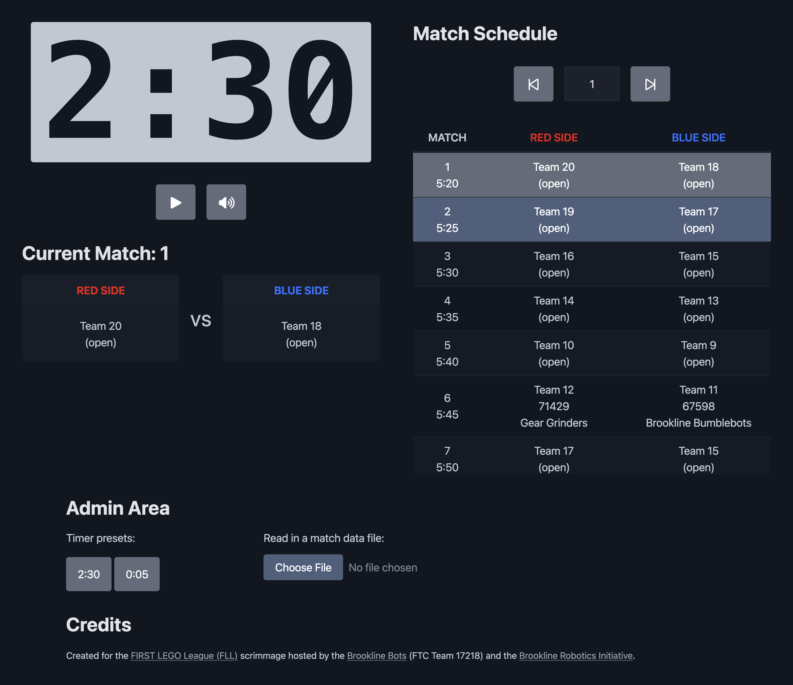

# FLL Scrimmage Display

This webpage is designed to serve as the main projected display for the [FIRST LEGO League (FLL)](https://www.firstlegoleague.org/) scrimmage hosted and organized by the [Brookline Robotics Initiative](https://www.brooklinerobotics.org/). The goal is to provide a timer for the robot game matches and an overview of the match schedule, including highlighting the teams competing in the current match along with the teams next up in the queue for the subsequent matches.

## Table of contents

- [Overview](#overview)
  - [Goals](#goals)
  - [Screenshots](#screenshots)
  - [Links](#links)
- [Implementation](#implementation)
  - [Built with](#built-with)
  - [Continued development](#continued-development)
  - [Related resources](#related-resources)
- [Acknowledgements](#acknowledgements)

## Overview

### Goals

Users should be able to:

- Start, stop, and reset a 2:30 robot game match timer
- See info of the two teams competing in the current robot game match
- See the match schedule, with highlighting of the current match and the match next up in the queue

### Screenshots

|        Mobile designed at 375px:         |        Tablet designed at 1440px:        | Desktop designed at 1440px:               |
| :--------------------------------------: | :--------------------------------------: | ----------------------------------------- |
|  |  |  |

### Links

- Code Repository URL: [https://github.com/elisilk/fll-scrimmage-display](https://github.com/elisilk/fll-scrimmage-display)
- Live Site URL: [https://elisilk.github.io/fll-scrimmage-display/](https://elisilk.github.io/fll-scrimmage-display/)

## Implementation

### Built with

- Semantic HTML5 markup
- CSS custom properties
- Accessibility
- [Pico](https://picocss.com/) - default styling
- [Font Awesome](https://fontawesome.com/) - icons
- [Pixabay](https://pixabay.com/sound-effects/) - sound effects
- [Fluid Style](https://fluid.style/) - fluid typography calculator

### Continued development

Known issues (specific areas that the solution should be improved):

- [ ] In the match schedule table, there is a transparent border spacing around the cells that allows user to see the cells underneath the header as the table is scrolled up vertically.
- [ ] Remove the delay between the start of the timer and the countdown of the first second.
- [ ] The game over sound effect doesn't play on iPhone Safari or Chrome (but does on Firefox), most likely due to an autoplay permissions issue:
  - [MDN Autoplay guide for media and Web Audio APIs > The play() method](https://developer.mozilla.org/en-US/docs/Web/Media/Guides/Autoplay#the_play_method)
  - [How to autoplay audio when the countdown timer is finished?](https://stackoverflow.com/questions/55490155/how-to-autoplay-audio-when-the-countdown-timer-is-finished)
- [x] Clean up styling of the countdown dialog so doesn't overflow and so it doesn't have a border or shadow.
- [x] On mobile devices, when moving to next match, prevent scrolling to the top of the match schedule table and/or initiate the page scrolling to a different desirable element (e.g., the timer).
- [x] The match schedule table gets crowded at middle viewport sizes. Hide a column and/or transition to a one-column format sooner.

Feature requests (enhancements to consider making) 🤔:

- [ ] Improve styling of the current match section, especially better highlighting of the current match number.
- [ ] Add an on-deck or next-up-in-the-queue to the current match section.
- [ ] Open a full-display alert dialog when the timer has completed.
- [ ] Style the timer to be a different color (or some other visual indicator) as the timer gets close to 0 (possibly the last 10 seconds).
- [ ] Include an audio countdown (or some other audio indicator) as the timer gets close to 0 (possibly the last 10 seconds).
- [ ] Add a progress bar for the timer countdown progress.
- [ ] Have a dropdown for different sound effect choices.
- [x] Change Pico color scheme (see [Pico > Version Picker > Theme color](https://picocss.com/docs/version-picker/))
- [x] Combine the start and play buttons so the 3-2-1-LEGO! countdown is done automatically.
- [x] Include sound to indicate both the start of the timer (the LEGO!) and the end of the timer (Time's up!).
- [x] Have option to read in a default CSV match schedule file.

### Related resources

Up-to-date official resources:

- [FIRST LEGO League (FLL)](https://www.firstlegoleague.org/)
- [FIRST Event Hub Official Scoring Calculator for Unearthed](https://eventhub.firstinspires.org/scoresheet)
  - [The Event Experience](https://www.firstinspires.org/robotics/fll/event-experience) - Event Hub - If your FIRST LEGO League event is utilizing the FIRST Event Hub, please access the website at: [eventhub.firstinspires.org](https://eventhub.firstinspires.org/login). The Event Hub is intended for FIRST coaches, mentors, and volunteers. Contact your local Program Delivery Partner if you require login credentials or experience technical difficulties.
- [MA FIRST local Program Delivery Partners](https://www.firstinspires.org/find-local-support#country=42&stateprov=4466)

Other unofficial resources:

- [FIRST LEGO League Developers GitHub](https://github.com/FirstLegoLeague) and associated [@Flltools YouTube channel](https://www.youtube.com/c/Flltools)
- [FLL-SW (FLL Software)](https://jpschewe.github.io/fll-sw/) and [GitHub Repository](https://github.com/jpschewe/fll-sw)
- [Droids Robotics FLL Tools](https://flltools.flltutorials.com/home) and [GitHub](https://github.com/droidsrobotics)
  - [FLLTutorials Tournament Scoring System](https://tournament.flltutorials.com/)
- [Komurobo FLL Tools](https://komurobo.com/fll/dashboard/)

## Acknowledgements

- Orginal Author - [Eli Silk](https://github.com/elisilk)
- Original Designer - Hailey Silk - Member of the Brookline Bots
- Scrimmage Organizer - [Brookline Robotics Initiative](https://www.brooklinerobotics.org/) and the [Brookline Bots](https://brooklinebots.org/) (FTC Team 17218)
