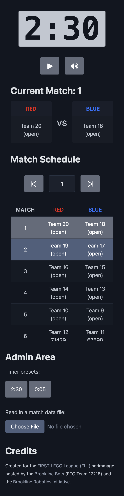
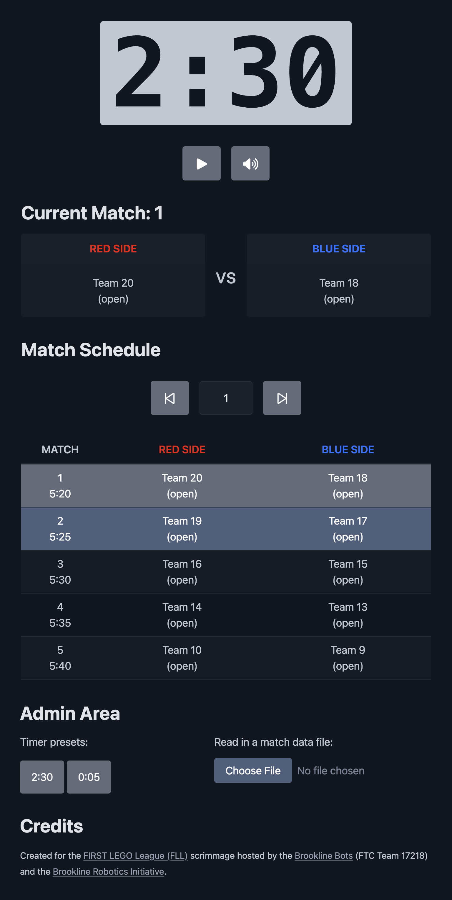

# FLL Scrimmage Display

This webpage is designed to serve as the main projected display for the [FIRST LEGO League (FLL)](https://www.firstlegoleague.org/) scrimmage hosted and organized by the [Brookline Robotics Initiative](https://www.brooklinerobotics.org/). The goal is to provide a timer for the robot game matches and an overview of the match schedule, including highlighting the teams competing in the current match along with the teams next up in the queue for the subsequent matches.

## Table of contents

- [Overview](#overview)
  - [Goals](#goals)
  - [Screenshots](#screenshots)
  - [Links](#links)
- [Implementation](#implementation)
  - [Built with](#built-with)
  - [Continued development](#continued-development)
  - [Related resources](#related-resources)
- [Acknowledgements](#acknowledgements)

## Overview

### Goals

Users should be able to:

- Start, stop, and reset a 2:30 robot game match timer
- See info of the two teams competing in the current robot game match
- See the match schedule, with highlighting of the current match and the match next up in the queue

### Screenshots

|        Mobile designed at 375px:         |        Tablet designed at 1440px:        | Desktop designed at 1440px:               |
| :--------------------------------------: | :--------------------------------------: | ----------------------------------------- |
|  |  |  |

### Links

- Code Repository URL: [https://github.com/elisilk/fll-scrimmage-display](https://github.com/elisilk/fll-scrimmage-display)
- Live Site URL: [https://elisilk.github.io/fll-scrimmage-display/](https://elisilk.github.io/fll-scrimmage-display/)

## Implementation

### Built with

- Semantic HTML5 markup
- CSS custom properties
- Accessibility
- [Pico](https://picocss.com/) - default styling
- [Font Awesome](https://fontawesome.com/) - icons
- [Fluid Style](https://fluid.style/) - fluid typography calculator

### Continued development

Known issues (specific areas that the solution should be improved):

Hmm 🤔 ...

Feature requests (specific enhancements to make):

Hmm 🤔 ...

### Related resources

- [Event Hub Official Scoring Calculator for Unearthed](https://eventhub.firstinspires.org/scoresheet)
- [FIRST LEGO League (FLL)](https://www.firstlegoleague.org/)

## Acknowledgements

- Orginal Author - [Eli Silk](https://github.com/elisilk)
- Original Designer - Hailey Silk - Member of the Brookline Bots
- Scrimmage Organizer - [Brookline Robotics Initiative](https://www.brooklinerobotics.org/) and the [Brookline Bots](https://brooklinebots.org/) (FTC Team 17218)
